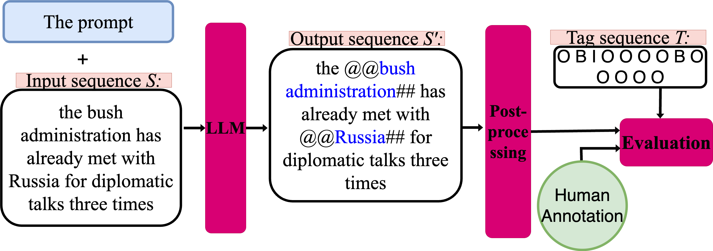

# Who-is-targeted
This is the code repository for the paper submitted at WebSci '24 titled [Who is targeted? Detecting social group mentions in online political discussions](https://dl.acm.org/doi/10.1145/3630744.3658412).


## Project Summary

Social groups are central to political discussions. However, detecting social groups in text often relies on pre-determined sociodemographic categories or supervised learning methods that require extensive hand-labeled datasets. In this paper, we propose a methodology designed to leverage the potential of Large Language Models (LLMs) for the identification and annotation of social groups in text. The experiments show that open LLMs like **Llama-2-70BChat** and **Mixtral-8-7B** can reliably be used to annotate social groups in a few-shot scenario without the need for supervised learning. The automatically obtained annotations largely match human annotations on random samples from the Reddit Politosphere, resulting
in micro-F1 scores of 0.71 and 0.83, respectively.

## Proposed workflow for social group identification using LLMs
Our workflow as described in the following figure, comprises three steps:
1. Providing the prompt and input sentence 𝑆 to an LLM; the LLM generates an output sequence 𝑆′ where social groups are annotated beginning with @@ and ending with ##
2. Post-processing, transforming the output sequence 𝑆′ into a BIO tag sequence 𝑇 for evaluation.
3. Evaluation by comparing to human annotations. We emphasize entity-level performance, prioritizing the model’s performance in recognizing complete mentions of social groups
(i.e., entity) rather than partial mentions. The extensive occurrence of “O” tags could distort the model’s performance
assessment using the token- or word-level evaluation




### The prompt used in our experiments based on [Chain-of-Thought prompting](https://arxiv.org/pdf/2201.11903):

 ````              
"""Determine whether the text below contains mentions of social groups. First, identify social groups based on this definition: Social groups are defined by two or more individuals who share some common characteristics. Commonalities shared by a social group include, for example, race, nationality, ethnicity, religion, gender, sexual orientation, socio-economic status, migration status, profession, family ties, and organizational and institutional ties. Second, do annotation for social groups starting with @@ and ending with ##.  The answer is in the following format:
The output starts with <annotation> and ends with </annotation> and the number of words in the output equals the number of words in the input.  

Below are some examples:

Text: Because when the middle class does well, the poor have a ladder up and the wealthy still do very well. 
Answer: <annotation> Because when @@the middle class## does well, @@the poor ##have a ladder up and @@the wealthy ##still do very well. </annotation>
Reason: the middle class, the poor, and the wealthy each one has a size of the group more than one and each group shares some characteristics.


Text: hillary is stating publicly that her true allegiance is to the ultra-zionists . not the democratic party , not the usa , not anyone. 
Answer: <annotation> hillary is stating publicly that her true allegiance is to the @@ultra-zionists## . not the @@democratic party## , not @@the usa##, not anyone. </annotation> 
Reason: since  ultra-zionists, democratic party, and the USA have more than one member, and each group shares some characteristics.


Text: President Biden said: near-record unemployment for Black and Hispanic workers. 
Answer: <annotation> President Biden said: near-record unemployment for @@Black and Hispanic workers##. </annotation>
Reason: Black and Hispanic workers is defined as a social group since it has more than one member, and each group shares some characteristics.

Text: Mr. Biden thanked Mr. Chaves, who was elected last year, for his leadership 
Answer: <annotation> Mr. Biden thanked Mr. Chaves, who was elected last year, for his leadership </annotation>
Reason: There is no mention of social groups in the text

Text:  <text_for_annotation> """
````
## Citation
If you utilize this repository and our work, please cite:

````
@inproceedings{10.1145/3630744.3658412,
author = {Jalali Farahani, Farane and Hanke, Sara and Dima, Corina and Heiberger, Raphael Heiko and Staab, Steffen},
title = {Who is targeted? Detecting social group mentions in online political discussions},
year = {2024},
isbn = {9798400704536},
publisher = {Association for Computing Machinery},
address = {New York, NY, USA},
url = {https://doi.org/10.1145/3630744.3658412},
doi = {10.1145/3630744.3658412},
booktitle = {Companion Publication of the 16th ACM Web Science Conference},
pages = {24–25},
numpages = {2},
keywords = {LLMs, political text, social groups},
location = {Stuttgart, Germany},
series = {Websci Companion '24}
}
````


